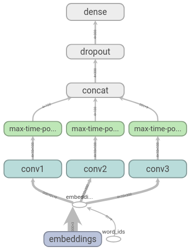

[](LICENSE)

# Sentiment classification with CNNs

This repository contains a TensorFlow implementation based on the paper *Convolutional Neural Networks for Sentence Classification* by Yoon Kim.

<div style="text-align:center;">
</br></br>
</div>

The model is trained with the Customer Reviews dataset, annotated by Minqing Hu and Bing Liu at the University of Illinois. More information can be found [here](https://www.cs.uic.edu/~liub/FBS/sentiment-analysis.html). Additionally, the model uses pretrained word embeddings obtained with [GloVe](https://nlp.stanford.edu/projects/glove/).

The main goals are:

- Preprocess and prepare raw data in the TFRecord format.
- Train the model and keep the weights with the highest accuracy in the dev set.
- Add nodes to the graph so that the model can take raw text as input, and save it in the SavedModel format.
- Test the model using the TensorFlow model server.

### Usage

Check for dependencies in the `requirements.txt` file.

Download the data and word embeddings:

```sh
bash get-data.sh
```

Create a vocabulary index (mapping words to integer IDs) and serialize the dataset:

```sh
python data.py
```

Train the CNN:

```sh
python train.py
```

Monitor training by running

```sh
tensorboard --logdir=runs
```

Export a servable model that can be used with the TensorFlow model server:

```sh
python export.py ckpt_path
```

where `ckpt_path` is the folder containing checkpoints for a particular run. The SavedModel is stored in the `servables` folder, in a numbered folder that increases every time `export.py` is called.

Install [TensorFlow ModelServer](https://www.tensorflow.org/serving/setup) and start a new server with the exported model:

```sh
tensorflow_model_server --model_base_path=$(pwd)/servables --rest_api_port=8501
```

Send test requests to the running server:

```sh
python test_server.py
```
